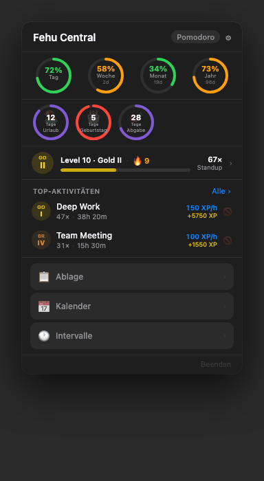
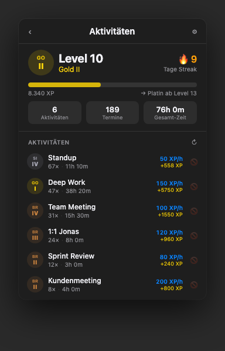

# Fehu Central

Native macOS menubar app for daily time awareness and productivity tracking. Built with Swift 6 and SwiftUI — no Xcode required.

  

---

## Screenshots

<table>
  <tr>
    <td><br><sub>Hauptseite</sub></td>
    <td><br><sub>Aktivitäten</sub></td>
  </tr>
</table>

---

## What it does

The menubar shows a live countdown to the end of your workday, next to the Fehu rune (ᚠ). Opening the popup gives you a full picture of where you stand in the day, week, month, and year — plus everything else.

## Features

**Time & Progress**
- Live countdown in the menubar (hours and minutes until workday end)
- Progress rings for Day / Week / Month / Year — percentage plus days remaining inside each ring
- Color shifts from green → orange → red as time runs out

**Calendar**
- Reads today's events from macOS Calendar
- Active event shown as a banner with a live progress bar
- Full event list accessible from the popup

**Gamification**
- Analyzes calendar history to build a list of recurring activities
- Each activity earns XP based on time spent (configurable XP/h rate)
- Bronze → Silver → Gold → Platinum → Diamond rank system across 20 levels
- Activities can be renamed, merged, or blacklisted directly from the popup

**Countdown events**
- Named dates shown as circular countdown rings (e.g. birthdays, deadlines, trips)
- Color-coded by urgency: green on the day, red within 3 days

**Pomodoro timer**
- Focus and break phases, configurable length
- Active session visible as a pill in the topbar

**Intervals**
- Named time blocks tied to a clock range (e.g. "Deep Work 09:00–11:00")
- Live progress bar and countdown when active
- Active interval shown as a banner in the popup

**Clipboard manager**
- Auto-records clipboard history
- Save entries as permanent snippets with optional labels
- Search across history and snippets
- Automatically skips password manager entries

---

## Requirements

- macOS 14 (Sonoma) or later
- Swift toolchain — install via `xcode-select --install`

---

## Build & Install

```bash
chmod +x build.sh
./build.sh
```

Compiles a release build, creates the app bundle at `~/Applications/FehuCentral.app`, and launches it. The version number is read from `VERSION` and written into `Info.plist` automatically.

---

## Releasing a new version

```bash
# Patch release: 2.0.0 → 2.0.1
./release.sh patch

# Minor release: 2.0.0 → 2.1.0
./release.sh minor

# Major release: 2.0.0 → 3.0.0
./release.sh major

# Release without bumping (use current VERSION as-is)
./release.sh
```

The script bumps `VERSION`, builds the app, zips the bundle, creates a git tag, pushes, and publishes a GitHub release with the zip attached.

---

## Project Structure

```
Sources/KITimer/
├── KITimerApp.swift          # @main entry, MenuBarExtra label
├── MainMenuView.swift        # Root view, page navigation, topbar
├── TimeManager.swift         # Workday progress, Pomodoro, intervals, notifications
├── CalendarManager.swift     # EventKit integration, permission handling
├── GamificationManager.swift # XP, levels, ranks, activity tracking
├── ClipboardManager.swift    # Clipboard polling, history, snippets
├── CircleRingView.swift      # Progress rings and countdown circles
├── FehuRune.swift            # Custom Path-drawn Fehu rune icon
├── GamificationPage.swift    # Activitiy list, XP editor, merge UI
├── CalendarPage.swift        # Today's event list
├── CountdownsPage.swift      # Countdown list and editor
├── IntervalsPage.swift       # Interval list and editor
├── ClipboardPage.swift       # Clipboard history and snippets UI
├── PomodoroSection.swift     # Pomodoro UI
└── SettingsView.swift        # Settings
```

---

## License

MIT — see [LICENSE](LICENSE).
